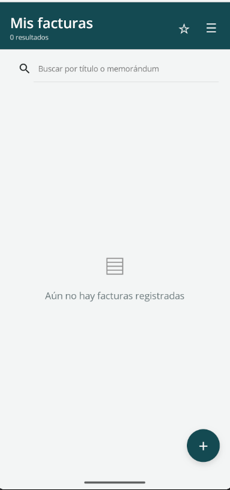
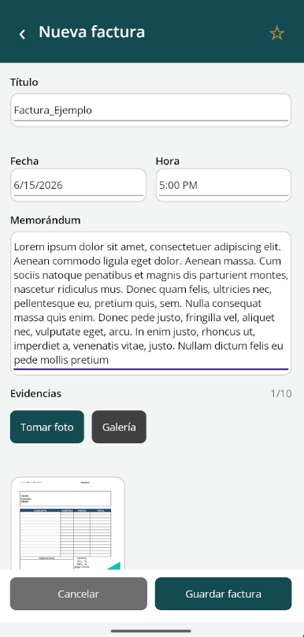
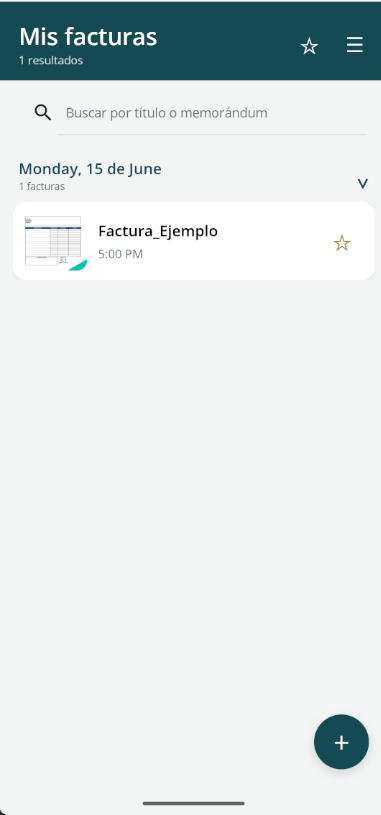
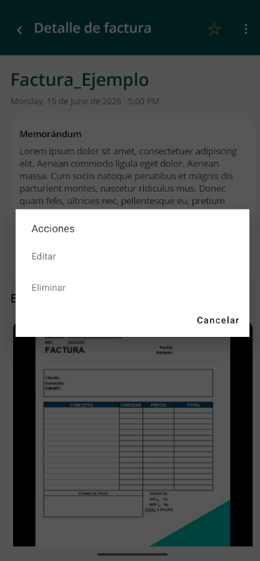

# Mis Facturas

Aplicación móvil para registrar, organizar y consultar facturas junto con sus
evidencias fotográficas. Está diseñada para funcionar sin conexión y mantener
la información dentro del almacenamiento privado del dispositivo.

## Vista previa

| Inicio sin facturas | Registro de factura |
| --- | --- |
|  |  |

| Facturas agrupadas | Detalle y acciones |
| --- | --- |
|  |  |

## Funcionalidades

- Registro y edición de facturas.
- Título, fecha, hora y memorándum opcional.
- Captura de fotografías con la cámara.
- Selección de imágenes desde la galería.
- Hasta 10 evidencias por factura.
- Vista previa de imágenes y apertura con el visor del dispositivo.
- Facturas agrupadas por fecha y ordenadas de la más reciente a la más antigua.
- Grupos de fechas plegables.
- Búsqueda por título o memorándum.
- Filtros por rango de fechas y estado favorito.
- Marcado de facturas como favoritas.
- Eliminación de facturas y sus evidencias.
- Interfaz en modo claro independientemente del tema del teléfono.
- Funcionamiento completamente sin conexión.

## Tecnologías

- C# y .NET 10
- .NET MAUI
- SQLite
- Entity Framework Core
- CommunityToolkit.Mvvm
- xUnit

## Estructura

```text
APP_FACTURA/
├── AppFactura/          Aplicación .NET MAUI para Android
├── AppFactura.Data/     Entidades, SQLite, EF Core y repositorios
├── AppFactura.Tests/    Pruebas unitarias y de persistencia
├── docs/images/         Capturas utilizadas en este README
└── AppFactura.slnx      Solución principal
```

## Requisitos

- .NET SDK 10
- Carga de trabajo de .NET MAUI para Android
- Android SDK
- Emulador Android o dispositivo físico

Comprueba las cargas de trabajo instaladas con:

```powershell
dotnet workload list
```

## Compilación

Desde la raíz del repositorio:

```powershell
dotnet restore .\AppFactura.slnx
dotnet build .\AppFactura\AppFactura.csproj -f net10.0-android
```

Para compilar y ejecutar en un emulador o dispositivo disponible:

```powershell
dotnet build .\AppFactura\AppFactura.csproj -t:Run -f net10.0-android
```

## Pruebas

```powershell
dotnet test .\AppFactura.Tests\AppFactura.Tests.csproj
```

## Generar el APK

```powershell
dotnet publish .\AppFactura\AppFactura.csproj `
  -f net10.0-android `
  -c Release `
  -p:AndroidPackageFormats=apk
```

El APK se genera dentro de:

```text
AppFactura/bin/Release/net10.0-android/publish/
```

## Almacenamiento y privacidad

La base de datos SQLite y las evidencias se guardan en el espacio privado de la
aplicación. No se utiliza una cuenta, conexión a Internet ni almacenamiento en
la nube.

Al desinstalar la aplicación, Android también elimina las facturas y las
imágenes almacenadas por ella.
